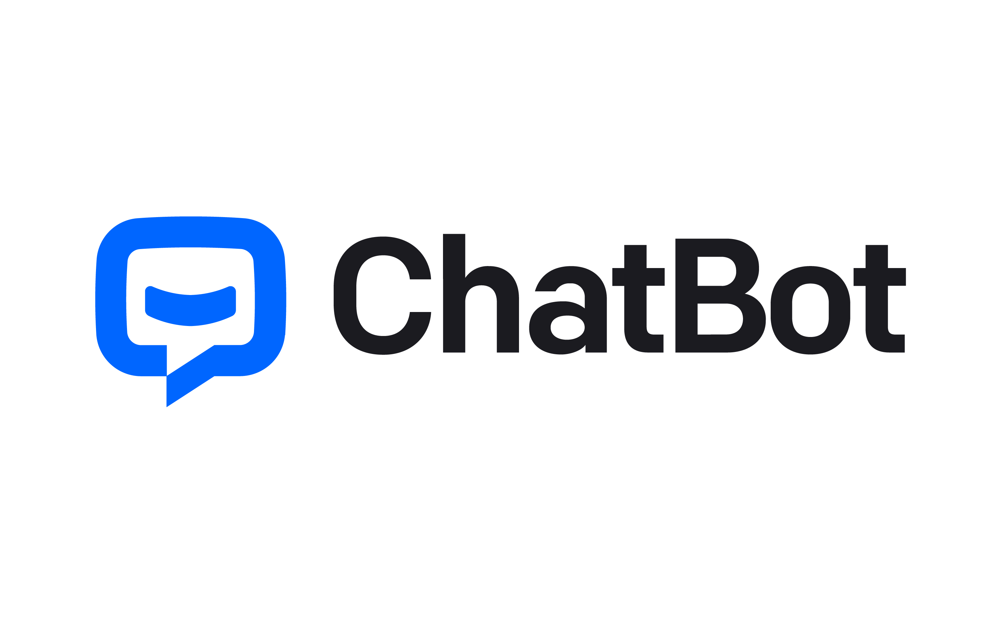
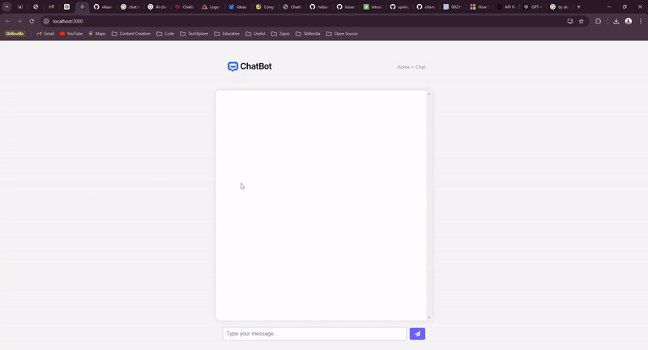

# spring-boot-ai-chatbot
Your friendly personal assistant powered by OpenAI

Here’s a detailed README file template for your project. This template covers the main aspects of your project, including an overview, installation steps, usage instructions, and more. You can customize it further according to your project’s specifics.

---

# Spring AI Chatbot Learning Application

## Overview

This project is a full-stack web application built with Spring Boot, Spring AI, React, and Docker. It serves as a learning tool for developers who want to get hands-on experience with Spring AI, leveraging the OpenAI API to create an intelligent chatbot. The chatbot can assist users in learning more about Spring AI by answering questions and providing information based on user queries.

## Features

- **Interactive Chatbot**: Engage with a chatbot to learn more about Spring AI and how to integrate it with your Spring Boot applications.
- **Spring Boot Backend**: A robust backend powered by Spring Boot, utilizing Spring AI for processing and generating responses using the OpenAI API.
- **React Frontend**: A user-friendly and responsive frontend built with React, providing an intuitive interface to interact with the chatbot.
- **Dockerized Setup**: Both the frontend and backend are containerized using Docker, allowing easy setup and deployment.

## Demo

Here’s a quick demo of how the project works:

### Image Example



### Video Example

Watch the demo video:




## Tech Stack

- **Backend**: 
  - Java 17
  - Spring Boot
  - Spring AI
  - OpenAI API
- **Frontend**:
  - React
  - HTML5 & CSS3
  - Axios
  - Nginx (for serving the React app)
- **DevOps**:
  - Docker
  - Docker Compose

## Prerequisites

Before you begin, ensure you have the following installed on your machine:

- [Docker](https://www.docker.com/products/docker-desktop)
- [Docker Compose](https://docs.docker.com/compose/install/)
- [Java 17](https://adoptopenjdk.net/) (if running the Spring Boot app locally)
- [Node.js](https://nodejs.org/) and [npm](https://www.npmjs.com/) (if running the React app locally)

## Getting Started

### Clone the Repository

```bash
git clone https://github.com/vikasrajputin/spring-ai-chatbot.git
cd spring-ai-chatbot
```

### Project Structure

The project is organized into two main directories:

- **spring-boot-ai-chatbot/**: Contains the Spring Boot application with Spring AI integration.
- **chatbot-ui/**: Contains the React application that serves as the chatbot interface.

### Setting Up the Environment

Before running the application, make sure to set up the environment variables for accessing the OpenAI API.

1. **Create a `.env` file in the `spring-boot-ai-chatbot` directory**:

    ```bash
    OPENAI_API_KEY=your_openai_api_key
    ```

2. **(Optional) Create a `.env` file in the `chatbot-ui` directory if needed**.

### Running the Application with Docker

The project is fully dockerized, making it easy to run both the frontend and backend together.

1. **Build and run the containers**:

    ```bash
    docker-compose up --build
    ```

2. **Access the application**:

    - The Spring Boot application (backend) will be available at: `http://localhost:8080`
    - The React application (frontend) will be available at: `http://localhost:3000`

### Running the Applications Locally (Without Docker)

#### Backend (Spring Boot)

1. **Navigate to the `spring-boot-ai-chatbot/` directory**:

    ```bash
    cd spring-boot-ai-chatbot/
    ```

2. **Build and run the Spring Boot application**:

    ```bash
    ./mvnw clean install spring-boot:run
    ```

3. **Access the backend API**: `http://localhost:8080`

#### Frontend (React)

1. **Navigate to the `chatbot-ui/` directory**:

    ```bash
    cd chatbot-ui
    ```

2. **Install the dependencies**:

    ```bash
    npm install
    ```

3. **Start the React application**:

    ```bash
    npm start
    ```

4. **Access the frontend**: `http://localhost:3000`

### API Endpoints

The backend provides the following key API endpoints:

- **`GET /ai/chat/string`**: Accepts a `message` query parameter and returns a response generated by the AI model.
  - **Example**: `http://localhost:8080/ai/chat/string?message=Tell me about Spring AI`
  
- **`POST /ai/chat`**: Accepts a JSON body with a `message` field and returns a response generated by the AI model.
  - **Example**:
    ```json
    POST http://localhost:8080/ai/chat
    Content-Type: application/json
    
    {
      "message": "Explain how to use OpenAI with Spring Boot"
    }
    ```

## Customization

### Modifying the Frontend

- The React frontend is located in the `chatbot-ui/` directory.
- You can customize the UI by editing the components in the `src/` directory.
- Update the styling by modifying the `Chatbot.css` file.

### Modifying the Backend

- The Spring Boot backend is located in the `spring-boot-ai-chatbot/` directory.
- You can customize the AI responses by modifying the services and controllers in the `src/main/java` directory.
- Update the Spring AI configuration in the `application.yml` file.

## Deployment

### Docker Deployment on Local

To deploy the application to a local environment, you can use the Docker images built with the provided Dockerfiles.

1. **Build the Docker images**:

    ```bash
    docker-compose build
    ```

### Manual Deployment (Without Docker)

- **Backend**: Deploy the Spring Boot jar to a server or cloud service (e.g., AWS EC2, Heroku).
- **Frontend**: Build the React app (`npm run build`) and serve it using a web server (e.g., Nginx, Apache).

## License

This project is licensed under the MIT License. See the [LICENSE](LICENSE) file for more information.